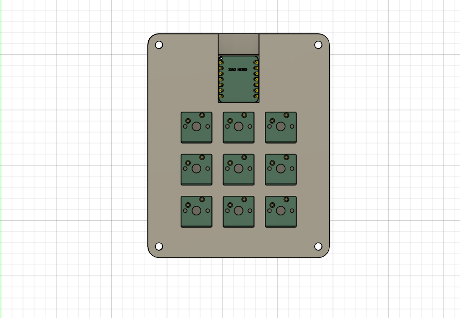
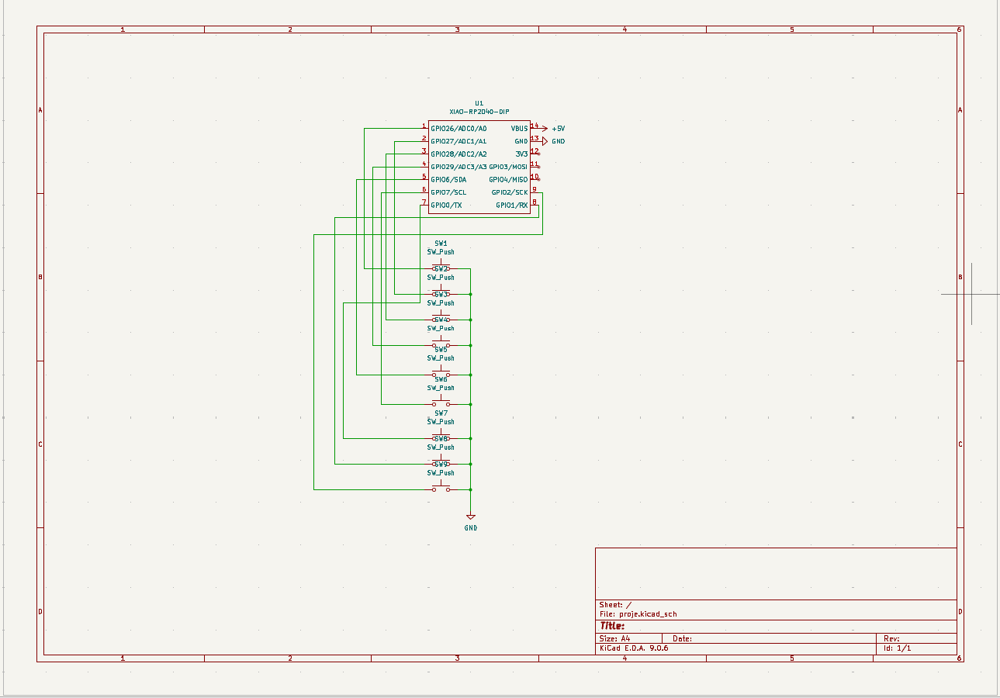
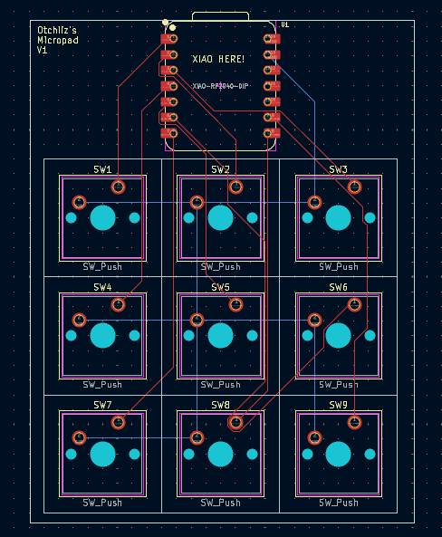
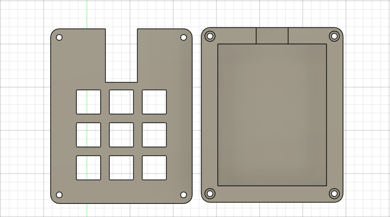

# Otchiiz's Macropad V1

*An almost finished view of the Macropad.*

## 📖 Description
Very simple and basic 9 keys macropad.

*   **Firmware:** QMK CONFIGURATOR | QMK FIRMWARE

---

## ⚡ Electronics Design

This project utilizes a custom PCB designed in KiCad.

### Schematic

### PCB Layout

---

## ⚙️ Mechanical Design (The Case)

The enclosure was designed in Fusion360 to ensure a tight fit for the PCB and comfortable ergonomics.

### Case Assembly

*Exploded view or assembled view of the 3D printed case showing how the PCB fits inside.*

---

## 🛒 Bill of Materials (BOM)

| Part Name | Quantity | Description |
| :--- | :---: | ---: |
| **Microcontroller** | 1 | Seeed XIAO RP2040 | 
| **Switches** | 9 | Cherry MX Style Mechanical Switches | 
| **Keycaps** | 9 | DSA Profile Keycaps |
| **Screws** | 4 | M3 x 16mm Screws|
| **Filament** | - | PLA for Case | 

---

## 🚀 Getting Started

### Prerequisites
*   Soldering Iron & Solder
*   [Specific Firmware Uploader if needed]

### Assembly Instructions
1.  **Print the Case:** Use the STL files located in the `CAD` folder.
2.  **Solder the PCB:** Solder the microcontroller and switches to the PCB.
3.  **Firmware:** Plug in the device and copy the Firmware file to the root directory.
4.  **Final Assembly:** Insert the PCB into the case and secure with M3 screws.

---
